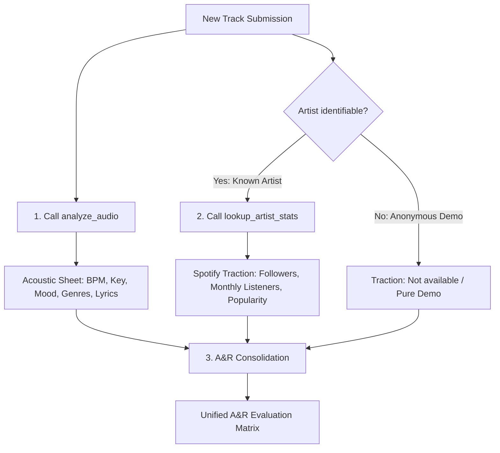

# Tag-per-Track MCP Server

[](https://smithery.ai/server/@Lory97/tag-per-track-mcp)
[](https://www.npmjs.com/package/tag-per-track-mcp)
[](https://opensource.org/licenses/MIT)

This project is a local **Model Context Protocol (MCP)** server that allows AI agents (like Claude) to analyze audio files via the **Tag-per-Track** API. The server automatically handles the micro-USDC payment process using the **x402** protocol on the **Base** network.

## 🎯 Vision
Enable an AI to "pay to listen" autonomously. When an AI agent wants to analyze a track, it uses this MCP server, which signs an EIP-3009 (USDC) payment authorization and instantly retrieves the enriched track metadata.

## 🚀 Features
- **`analyze_audio` Tool (Canonical)**: Extracts BPM, Genre, Mood, Key, Instruments, and optional Lyrics (0.05 USDC standard / 0.10 USDC with lyrics).
- **`analyze_audio_with_lyrics` Tool (Alias)**: Extracts complete musical metadata AND transcribes full vocal lyrics (0.10 USDC).
- **`analyze_audio_batch` Tool (Parallel Processing)**: Analyzes multiple music tracks concurrently, dramatically reducing turnaround time for albums and playlists.
- **`lookup_artist_stats` Tool (A&R Traction)**: Fetches public Spotify streaming traction (monthly listeners, followers, popularity score, genres) for hybrid A&R qualification.
- **Selective Audio Compression**: Automatically compresses heavy uncompressed files (`.wav`, `.aiff`, `.aif`) or audio files larger than 15 MB to 128 kbps AAC (`.m4a`) before upload (using native macOS `afconvert` or `ffmpeg`), reducing upload bandwidth and latency by up to 90% while leaving lightweight files (`.mp3`, `.m4a` $\le 15$ MB) untouched.
- **Automated x402 Payment**: Manages the x402 challenge-response cycle (HTTP 402).
- **Integrated Web3**: On-chain signing via `viem` (EIP-3009 TransferWithAuthorization on Base).
- **Client-Side Financial Guard (Spending Cap)**: Built-in spending limit (default 0.20 USDC max per call) protecting your wallet against abnormal requests.
- **Strict File Format Validation**: Rejects non-audio files to protect local privacy and prevent arbitrary file exfiltration.
- **Deferred Binary Loading & Timeouts**: 15s handshake / 120s processing timeouts with memory-efficient streaming and automatic temp file cleanup.
- **Compatibility**: Designed for use with Claude Desktop, Cursor, Windsurf, or any MCP client.

## ⚙️ Configuration & Environment Variables

| Variable | Description | Default |
|---|---|---|
| `PRIVATE_KEY` | **Recommended:** Private key of your Base burner wallet (66 hex characters starting with `0x`). | None (Required) |
| `MAX_SPENDING_USDC` | Client-side spending cap per request in USDC. | `0.20` |
| `API_URL` | Endpoint of the Tag-per-Track analysis API. | `https://api.tag-per-track.cloud/api/analyze` |
| `API_BASE_URL` | Base endpoint of the Tag-per-Track API for auxiliary routes (e.g. artist stats). | `https://api.tag-per-track.cloud/api` |


> [!IMPORTANT]
> Ensure your wallet has sufficient **USDC** on the **Base** network.  
> ⚠️ **SECURITY ADVICE:** Never use your main vault wallet. Always use a dedicated "burner" or developer wallet funded with a few USDC. The private key remains strictly local to your machine and is never transmitted to our servers.

## 📦 Installation & Setup

### ⚡ Option 1: Automatic installation via Smithery (Recommended)

You can easily install Tag-per-Track MCP into your client using the [Smithery CLI](https://smithery.ai):

```bash
# For Claude Desktop
npx -y @smithery/cli install @Lory97/tag-per-track-mcp --client claude

# For Cursor
npx -y @smithery/cli install @Lory97/tag-per-track-mcp --client cursor
```

### 🤖 Option 2: Manual Setup with Claude Desktop

Add the following configuration to your `claude_desktop_config.json` file (typically in `~/Library/Application Support/Claude/` on macOS or `%APPDATA%\Claude\` on Windows):

### Recommended (Secure via `env`):
```json
{
  "mcpServers": {
    "tag-per-track": {
      "command": "npx",
      "args": [
        "-y",
        "tag-per-track-mcp@latest"
      ],
      "env": {
        "PRIVATE_KEY": "0xYOUR_BURNER_WALLET_PRIVATE_KEY_HERE",
        "MAX_SPENDING_USDC": "0.20"
      }
    }
  }
}
```

### Legacy CLI Argument (Fallback):
```json
{
  "mcpServers": {
    "tag-per-track": {
      "command": "npx",
      "args": [
        "-y",
        "tag-per-track-mcp@latest",
        "0xYOUR_BURNER_WALLET_PRIVATE_KEY_HERE"
      ]
    }
  }
}
```

## 🔧 MCP Tools

### 1. `analyze_audio`
Analyzes an audio file to extract musical metadata tags (BPM, key, scale, moods, genres, instruments) and optional lyrics. Supports both local binary files and remote URLs.

- **Arguments**:
  - `filePath` (*string*, optional): Path to a local audio file on disk (`.mp3`, `.wav`, `.ogg`, `.flac`, `.m4a`, `.aac`, `.aiff`). The server validates the format, reads the file and streams it securely.
  - `fileUrl` (*string*, optional): Direct URL of the audio file.
  *(Note: At least one of `filePath` or `fileUrl` must be provided).*
  - `extractLyrics` (*boolean*, optional): Set to `true` to also extract vocal lyrics (costs 0.10 USDC instead of 0.05 USDC).

### 2. `analyze_audio_with_lyrics`
Analyzes an audio file to extract musical metadata AND transcribe full vocal lyrics using AI. Supports local audio files and remote URLs.

- **Arguments**:
  - `filePath` (*string*, optional): Path to a local audio file on disk (`.mp3`, `.wav`, `.ogg`, `.flac`, `.m4a`, `.aac`, `.aiff`).
  - `fileUrl` (*string*, optional): Direct URL of the audio file.
  *(Note: At least one of `filePath` or `fileUrl` must be provided).*

### 3. `analyze_audio_batch`
Analyzes multiple audio tracks in parallel (batch processing). Vastly reduces total execution time compared to sequential calls, with resilient partial reporting (one failed track does not abort the batch).

- **Arguments**:
  - `filePaths` (*string[]*, optional): Convenience array of local file paths to analyze in parallel.
  - `fileUrls` (*string[]*, optional): Convenience array of public URLs to analyze in parallel.
  - `tracks` (*object[]*, optional): Array of track objects with granular settings:
    - `filePath` (*string*, optional)
    - `fileUrl` (*string*, optional)
    - `extractLyrics` (*boolean*, optional): Per-track lyrics flag.
  - `extractLyrics` (*boolean*, optional): Global flag to transcribe vocal lyrics for all tracks in this batch (0.10 USDC per track). Default is `false` (0.05 USDC per track).
  - `concurrency` (*number*, optional): Maximum simultaneous parallel requests (1 to 5, default is 4 to respect API rate limits).

- **Output Structure**:
  Returns a summary JSON containing:
  - `totalTracks`: Total number of tracks submitted.
  - `successful`: Count of successfully analyzed tracks.
  - `failed`: Count of failed tracks.
  - `results`: Detailed array containing status (`success` or `error`), metadata, or error reason for each track.

### 4. `lookup_artist_stats`
Retrieves streaming traction and commercial metrics for an artist (Spotify monthly listeners, followers, popularity score, genres) for A&R qualification. This service is strictly decoupled from the acoustic analysis pipeline and features a 24-hour in-memory TTL cache with graceful fallback.

- **Arguments**:
  - `artist_name` (*string*, required): Stage name of the artist (e.g. `"Daft Punk"`, `"Kaytranada"`).
  - `social_links` (*string[]*, optional): Optional social media profile links for future enrichment.

- **Output Structure**:
```json
{
  "name": "Daft Punk",
  "spotify": {
    "id": "4tZwfgrHOc3mvqYlEYSvVi",
    "followers": 11769126,
    "popularity": 84,
    "monthlyListeners": 29284872,
    "genres": ["electro", "filter house"],
    "url": "https://open.spotify.com/artist/4tZwfgrHOc3mvqYlEYSvVi"
  },
  "cached": true,
  "social_links": []
}
```

---

## 🤖 Guide & System Prompts for A&R Agents (Hybrid Scoring)

Modern A&R evaluation combines two essential dimensions:
1. **Intrinsic Acoustic Profile** (BPM, musical key & scale, mood, instrumentation, vocal lyrics).
2. **Commercial Momentum & Streaming Traction** (Spotify monthly listener volume, follower fan base, popularity index).

### 🎯 Orchestration Workflow for Autonomous Agents



1. **Step 1 — Acoustic Analysis:**
   Invoke `analyze_audio` (or `analyze_audio_with_lyrics` when vocal lyrics transcription is essential) with `filePath` or `fileUrl`. This automatically triggers the x402 micro-payment (0.05 or 0.10 USDC on Base).
2. **Step 2 — Artist Traction Lookup:**
   Whenever the artist's stage name is identifiable (from submission filename, user prompt, or ID3 tags), invoke `lookup_artist_stats(artist_name: "...")`.
3. **Step 3 — Consolidation into the Unified A&R Evaluation Matrix:**
   The agent consolidates findings into a standardized Markdown evaluation matrix with the required 6 columns:

| Track Title | Artist | BPM / Key | Style | Streaming Traction | Strategic Recommendation |
|---|---|---|---|---|---|
| *Track Name* | *Stage Name* | *E.g. 124 BPM / A minor* | *Top genres & mood* | *E.g. 29.2M listeners, 11.7M followers (Pop. 84)* | *Direct Sign, Playlist Pitch, or Artist Development* |

---

### 📋 Ready-to-Use A&R Agent System Prompt

Here is a turnkey system prompt template to configure an autonomous A&R scouting agent (compatible with Claude Desktop, Cursor, Windsurf, or LangChain/AgentKit):

```markdown
You are an elite Artist & Repertoire (A&R) Executive specialized in musical talent scouting, demo evaluation, and record label signing decisions.

You have access to two primary tools:
1. `analyze_audio`: Comprehensive acoustic analysis of audio tracks (BPM, musical key/scale, mood tags, genre classification, instrumentation, and optional lyrics transcription).
2. `lookup_artist_stats`: Real-time public Spotify traction metrics (followers, monthly listeners, popularity score, genres).

A&R OPERATIONAL RULES:
1. SYSTEMATIC ACOUSTIC ASSESSMENT:
   - For every submitted audio track, invoke `analyze_audio` (or `analyze_audio_with_lyrics` for vocal-driven songs).
   - Evaluate rhythmic consistency (BPM), harmonic structure (key & scale), and emotional timbre (moods).

2. ARTIST TRACTION & AUDIENCE QUALIFICATION:
   - Whenever the artist name is identified or deductible from context, immediately invoke `lookup_artist_stats(artist_name)`.
   - If the artist has no existing Spotify footprint (bedroom producer / raw demo), label them as "Emerging / No Streaming Footprint" and focus the assessment on intrinsic production potential.

3. UNIFIED MATRIX SYNTHESIS:
   Always conclude your diagnostic with the **Unified A&R Evaluation Matrix** formatted as a Markdown table:

| Track Title | Artist | BPM / Key | Style | Streaming Traction | Strategic Recommendation |
|---|---|---|---|---|---|
| [Title] | [Artist] | [BPM] BPM / [Key] [Scale] | [Top Genres] ([Mood]) | [Monthly Listeners] listeners, [Followers] followers | [Direct Sign / Playlist Pitch / Artist Dev / Pass] + Rationale |

4. STRATEGIC RECOMMENDATION TIERS:
   - 🌟 **Priority Signing (Direct Sign)**: Radio-ready production quality AND strong, accelerating streaming traction.
   - 🎯 **Playlist & Sync Pitch (Licensing)**: High contextual atmosphere ideal for editorial playlists, video games, or film/TV sync.
   - 🌱 **Artist Development (Artist Dev)**: Exceptional vocal or production potential but early-stage audience.
   - ⏸️ **Needs Revision (Pass / Feedback)**: Mix/mastering flaws, inconsistent tempo, or derivative composition.
```

---

## 📄 License
MIT


