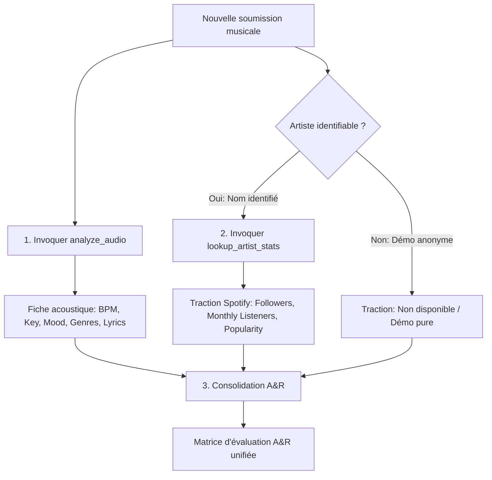

# Tag-per-Track MCP Server

This project is a local **Model Context Protocol (MCP)** server that allows AI agents (like Claude) to analyze audio files via the **Tag-per-Track** API. The server automatically handles the micro-USDC payment process using the **x402** protocol on the **Base** network.

## 🎯 Vision
Enable an AI to "pay to listen" autonomously. When an AI agent wants to analyze a track, it uses this MCP server, which signs an EIP-3009 (USDC) payment authorization and instantly retrieves the enriched track metadata.

## 🚀 Features
- **`analyze_audio` Tool (Canonical)**: Extracts BPM, Genre, Mood, Key, Instruments, and optional Lyrics (0.05 USDC standard / 0.10 USDC with lyrics).
- **`analyze_audio_with_lyrics` Tool (Alias)**: Extracts complete musical metadata AND transcribes full vocal lyrics (0.10 USDC).
- **`analyze_audio_batch` Tool (Parallel Processing)**: Analyzes multiple music tracks concurrently, dramatically reducing turnaround time for albums and playlists.
- **`lookup_artist_stats` Tool (A&R Traction)**: Fetches public Spotify streaming traction (monthly listeners, followers, popularity score, genres) for hybrid A&R qualification.
- **Selective Audio Compression**: Automatically compresses heavy uncompressed files (`.wav`, `.aiff`, `.aif`) or audio files larger than 15 MB to 128 kbps AAC (`.m4a`) before upload (using native macOS `afconvert` or `ffmpeg`), reducing upload bandwidth and latency by up to 90% while leaving lightweight files (`.mp3`, `.m4a` $\le 15$ MB) untouched.
- **Automated x402 Payment**: Manages the x402 challenge-response cycle (HTTP 402).
- **Integrated Web3**: On-chain signing via `viem` (EIP-3009 TransferWithAuthorization on Base).
- **Client-Side Financial Guard (Spending Cap)**: Built-in spending limit (default 0.20 USDC max per call) protecting your wallet against abnormal requests.
- **Strict File Format Validation**: Rejects non-audio files to protect local privacy and prevent arbitrary file exfiltration.
- **Deferred Binary Loading & Timeouts**: 15s handshake / 120s processing timeouts with memory-efficient streaming and automatic temp file cleanup.
- **Compatibility**: Designed for use with Claude Desktop, Cursor, Windsurf, or any MCP client.

## ⚙️ Configuration & Environment Variables

| Variable | Description | Default |
|---|---|---|
| `PRIVATE_KEY` | **Recommended:** Private key of your Base burner wallet (66 hex characters starting with `0x`). | None (Required) |
| `MAX_SPENDING_USDC` | Client-side spending cap per request in USDC. | `0.20` |
| `API_URL` | Endpoint of the Tag-per-Track analysis API. | `https://api.tag-per-track.cloud/api/analyze` |
| `API_BASE_URL` | Base endpoint of the Tag-per-Track API for auxiliary routes (e.g. artist stats). | `https://api.tag-per-track.cloud/api` |


> [!IMPORTANT]
> Ensure your wallet has sufficient **USDC** on the **Base** network.  
> ⚠️ **SECURITY ADVICE:** Never use your main vault wallet. Always use a dedicated "burner" or developer wallet funded with a few USDC. The private key remains strictly local to your machine and is never transmitted to our servers.

## 🤖 Usage with Claude Desktop

Add the following configuration to your `claude_desktop_config.json` file (typically in `~/Library/Application Support/Claude/` on macOS or `%APPDATA%\Claude\` on Windows):

### Recommended (Secure via `env`):
```json
{
  "mcpServers": {
    "tag-per-track": {
      "command": "npx",
      "args": [
        "-y",
        "tag-per-track-mcp@latest"
      ],
      "env": {
        "PRIVATE_KEY": "0xYOUR_BURNER_WALLET_PRIVATE_KEY_HERE",
        "MAX_SPENDING_USDC": "0.20"
      }
    }
  }
}
```

### Legacy CLI Argument (Fallback):
```json
{
  "mcpServers": {
    "tag-per-track": {
      "command": "npx",
      "args": [
        "-y",
        "tag-per-track-mcp@latest",
        "0xYOUR_BURNER_WALLET_PRIVATE_KEY_HERE"
      ]
    }
  }
}
```

## 🔧 MCP Tools

### 1. `analyze_audio`
Analyzes an audio file to extract musical metadata tags (BPM, key, scale, moods, genres, instruments) and optional lyrics. Supports both local binary files and remote URLs.

- **Arguments**:
  - `filePath` (*string*, optional): Path to a local audio file on disk (`.mp3`, `.wav`, `.ogg`, `.flac`, `.m4a`, `.aac`, `.aiff`). The server validates the format, reads the file and streams it securely.
  - `fileUrl` (*string*, optional): Direct URL of the audio file.
  *(Note: At least one of `filePath` or `fileUrl` must be provided).*
  - `extractLyrics` (*boolean*, optional): Set to `true` to also extract vocal lyrics (costs 0.10 USDC instead of 0.05 USDC).

### 2. `analyze_audio_with_lyrics`
Analyzes an audio file to extract musical metadata AND transcribe full vocal lyrics using AI. Supports local audio files and remote URLs.

- **Arguments**:
  - `filePath` (*string*, optional): Path to a local audio file on disk (`.mp3`, `.wav`, `.ogg`, `.flac`, `.m4a`, `.aac`, `.aiff`).
  - `fileUrl` (*string*, optional): Direct URL of the audio file.
  *(Note: At least one of `filePath` or `fileUrl` must be provided).*

### 3. `analyze_audio_batch`
Analyzes multiple audio tracks in parallel (batch processing). Vastly reduces total execution time compared to sequential calls, with resilient partial reporting (one failed track does not abort the batch).

- **Arguments**:
  - `filePaths` (*string[]*, optional): Convenience array of local file paths to analyze in parallel.
  - `fileUrls` (*string[]*, optional): Convenience array of public URLs to analyze in parallel.
  - `tracks` (*object[]*, optional): Array of track objects with granular settings:
    - `filePath` (*string*, optional)
    - `fileUrl` (*string*, optional)
    - `extractLyrics` (*boolean*, optional): Per-track lyrics flag.
  - `extractLyrics` (*boolean*, optional): Global flag to transcribe vocal lyrics for all tracks in this batch (0.10 USDC per track). Default is `false` (0.05 USDC per track).
  - `concurrency` (*number*, optional): Maximum simultaneous parallel requests (1 to 5, default is 4 to respect API rate limits).

- **Output Structure**:
  Returns a summary JSON containing:
  - `totalTracks`: Total number of tracks submitted.
  - `successful`: Count of successfully analyzed tracks.
  - `failed`: Count of failed tracks.
  - `results`: Detailed array containing status (`success` or `error`), metadata, or error reason for each track.

### 4. `lookup_artist_stats`
Récupère les métriques de traction et de streaming d'un artiste (auditeurs Spotify, abonnés, score de popularité, genres) pour la qualification A&R. Ce service est strictement découplé de l'analyse acoustique et bénéficie d'un cache mémoire TTL de 24h.

- **Arguments**:
  - `artist_name` (*string*, requis) : Nom de scène de l'artiste (ex: `"Daft Punk"`, `"Kaytranada"`).
  - `social_links` (*string[]*, optionnel) : Liens optionnels vers les profils sociaux pour un enrichissement futur.

- **Output Structure**:
```json
{
  "name": "Daft Punk",
  "spotify": {
    "id": "4tZwfgrHOc3mvqYlEYSvVi",
    "followers": 11769126,
    "popularity": 84,
    "monthlyListeners": 29284872,
    "genres": ["electro", "filter house"],
    "url": "https://open.spotify.com/artist/4tZwfgrHOc3mvqYlEYSvVi"
  },
  "cached": true,
  "social_links": []
}
```

---

## 🤖 Guide & Prompts Système pour Agents A&R (Scoring Hybride)

L'évaluation A&R moderne combine deux dimensions fondamentales :
1. **Fiche acoustique intrinsèque** (BPM, tonalité/scale, mood, instrumentation, paroles).
2. **Traction & potentiel commercial** (volume d'auditeurs Spotify, fidélité/abonnés, momentum/popularité).

### 🎯 Workflow d'Orchestration pour l'Agent



1. **Étape 1 — Analyse Acoustique :**
   Appeler `analyze_audio` (ou `analyze_audio_with_lyrics` si le texte ou le message vocal est primordial) avec `filePath` ou `fileUrl`. Ce processus déclenche automatiquement le micro-paiement x402 de 0.05 ou 0.10 USDC.
2. **Étape 2 — Lookup Traction Artiste :**
   Dès que le nom de scène de l'artiste est connu (dans le titre du fichier, le prompt utilisateur ou les métadonnées ID3), invoquer `lookup_artist_stats(artist_name: "...")`.
3. **Étape 3 — Consolidation dans la Matrice d'Évaluation A&R Unifiée :**
   L'agent synthétise les données dans un tableau standardisé comportant impérativement les 6 colonnes suivantes :

| Titre | Artiste | BPM / Clé | Style | Traction Streaming | Recommandation stratégique |
|---|---|---|---|---|---|
| *Nom du morceau* | *Nom de scène* | *Ex: 124 BPM / A minor* | *Genres dominants & humeur* | *Ex: 29.2M auditeurs, 11.7M abonnés (Pop. 84)* | *Signature immédiate, Placement playlist, ou Développement* |

---

### 📋 Exemple de Prompt Système pour Agents A&R

Voici un exemple de prompt système prêt à l'emploi pour configurer un agent IA A&R (sur Claude Desktop, Cursor, ou LangChain/AgentKit) :

```markdown
Tu es un Directeur Artistique (A&R Executive) d'élite spécialisé dans le scouting musical, l'analyse de démos et la signature de talents.

Tu as accès à deux outils principaux :
1. `analyze_audio` : Analyse acoustique complète d'un fichier audio (BPM, tonalité/gamme, humeur, genre, instrumentation, et optionnellement paroles).
2. `lookup_artist_stats` : Récupération des métriques publiques Spotify (abonnés, auditeurs mensuels, indice de popularité, profil de streaming).

RÈGLES DE COMPORTEMENT A&R :
1. ANALYSE ACOUSTIQUE SYSTÉMATIQUE :
   - Pour chaque fichier soumis, invoque `analyze_audio` (ou `analyze_audio_with_lyrics` pour les morceaux à fort contenu vocal).
   - Identifie la cohérence du tempo (BPM), la structure harmonique (clé et gamme) et la couleur émotionnelle (moods).

2. ANALYSE DE TRACTION ARTISTE :
   - Si le nom de l'artiste est mentionné ou déductible des métadonnées, invoque immédiatement `lookup_artist_stats(artist_name)`.
   - Si l'artiste n'a pas encore de profil Spotify (artiste émergent de chambre / démo pure), note-le comme « Émergent / Sans empreinte streaming » et axe l'évaluation sur le potentiel acoustique pur.

3. RESTITUTION DANS LA MATRICE UNIFIÉE :
   Termine toujours ton diagnostic par la **Matrice d'évaluation A&R unifiée** sous forme de tableau Markdown :

| Titre | Artiste | BPM / Clé | Style | Traction Streaming | Recommandation stratégique |
|---|---|---|---|---|---|
| [Titre] | [Artiste] | [BPM] BPM / [Clé] [Gamme] | [Genres principaux] ([Mood]) | [Auditeurs mensuels] auditeurs, [Abonnés] abonnés | [Signer / Playlist / Développer / Rejeter] + Justification |

4. CATÉGORIES DE RECOMMANDATIONS STRATÉGIQUES :
   - 🌟 **Signature Prioritaire (Direct Sign)** : Qualité de production radio-ready ET forte traction streaming croissante.
   - 🎯 **Pitch Playlist & Sync (Licensing)** : Métriques d'ambiance parfaites pour des playlists éditoriales ou du placement synchro média/jeux vidéo.
   - 🌱 **Développement Artistique (Artist Dev)** : Production ou voix à fort potentiel mais audience encore embryonnaire.
   - ⏸️ **À retravailler (Pass / Feedback)** : Mixage imparfait, BPM instable ou manque d'originalité artistique.
```

---

## 📄 License
MIT


