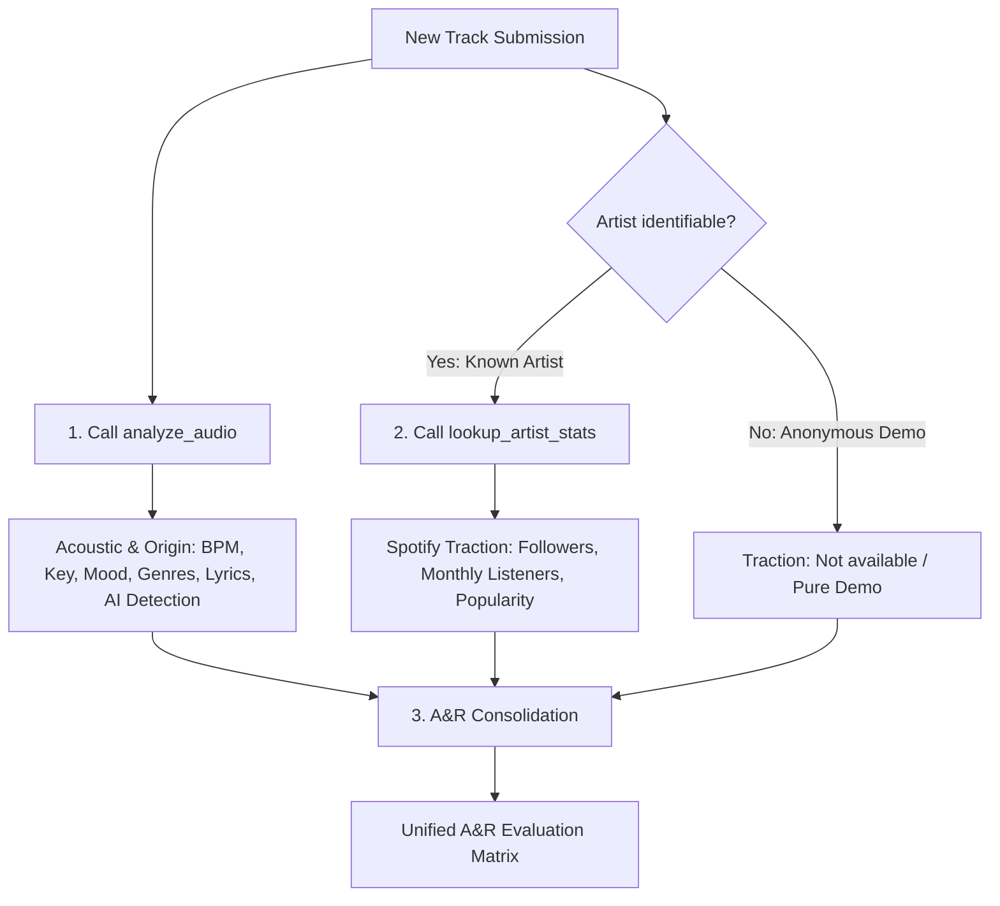

# Tag-per-Track MCP Server

[](https://smithery.ai/server/@Lory97/tag-per-track-mcp)
[](https://www.npmjs.com/package/tag-per-track-mcp)
[](https://opensource.org/licenses/MIT)

This project is a local **Model Context Protocol (MCP)** server that allows AI agents (like Claude) to analyze audio files via the **Tag-per-Track** API. It authenticates either with a **Studio API key** (prepaid credits bought on [tag-per-track.cloud](https://tag-per-track.cloud), no crypto needed) or with a wallet, in which case it automatically handles the USDC micro-payment using the **x402** protocol on the **Base** network.

## 🎯 Vision
Enable an AI to "pay to listen" autonomously. When an AI agent wants to analyze a track, it uses this MCP server, which signs an EIP-3009 (USDC) payment authorization and instantly retrieves the enriched track metadata.

## 🚀 Features
- **`analyze_audio` Tool (Canonical)**: Extracts BPM, Genre, Mood, Key, Instruments, production metrics, optional Lyrics (1 credit or 0.15 USDC standard / 2 credits or 0.25 USDC with lyrics), **AI-Generated Music Detection** (`ai_detection`: Suno, Udio, neural vocoders with `HUMAN`, `AI_GENERATED`, or `UNCERTAIN` verdicts) and the server-side **A&R evaluation** (`arEvaluation`: discovery / signing / beatmaker profiles).
- **`analyze_audio_with_lyrics` Tool (Alias)**: Extracts complete musical metadata, transcribes full vocal lyrics, and returns AI origin integrity metrics (2 credits or 0.25 USDC).
- **`analyze_audio_batch` Tool (Parallel Processing)**: Analyzes multiple music tracks concurrently with AI origin detection on every track, dramatically reducing turnaround time for albums and playlists.
- **`triage_demo_folder` Tool (Demo Inbox Triage)**: Sorts a whole local folder of demos in one call: analysis, artist/title from `Artist - Title` file names or audio tags, Spotify traction, A&R scoring v2 re-computed with the traction, and a compact ranked report with buckets (`priority`, `listen`, `pass`, `ai_flagged`, `error`). Unreliable lyrics (instrumental, no voice, looping hallucination) are flagged instead of quoted.
- **`lookup_artist_stats` Tool (A&R Traction)**: Fetches public Spotify streaming traction (monthly listeners, followers, popularity score, genres) for hybrid A&R qualification.
- **Selective Audio Compression**: Automatically compresses heavy uncompressed files (`.wav`, `.aiff`, `.aif`) or audio files larger than 15 MB to 128 kbps AAC (`.m4a`) before upload (using native macOS `afconvert` or `ffmpeg`), reducing upload bandwidth and latency by up to 90% while leaving lightweight files (`.mp3`, `.m4a` $\le 15$ MB) untouched.
- **Dual Authentication**: Studio API key (`Authorization: Bearer tpt_live_…`, prepaid credits) takes priority over the Web3 wallet.
- **Automated x402 Payment**: Manages the x402 challenge-response cycle (HTTP 402), with the platform wallet and USDC contracts pinned client-side.
- **Integrated Web3**: On-chain signing via `viem` (EIP-3009 TransferWithAuthorization on Base).
- **Client-Side Financial Guard (Spending Cap)**: Built-in spending limit (default 0.50 USDC max per call) protecting your wallet against abnormal requests.
- **Confidential by Default for x402**: Wallet-paid analyses are sent with `x-no-persist` (not stored server-side); Studio API key analyses are saved to your dashboard history unless `TAG_PER_TRACK_NO_PERSIST=1`.
- **Prompts**: `triage_demos` (sort a demo folder into a ranked shortlist and sub-folders), `qualify_demo_ar` (single demo A&R qualification) and `batch_demo_screening` (multi-track screening).
- **Strict File Format Validation**: Rejects non-audio files to protect local privacy and prevent arbitrary file exfiltration.
- **Deferred Binary Loading & Timeouts**: 15s handshake / 120s processing timeouts with memory-efficient streaming and automatic temp file cleanup.
- **Compatibility**: Designed for use with Claude Desktop, Cursor, Windsurf, or any MCP client.

## ⚙️ Configuration & Environment Variables

The MCP server supports **Dual Authentication**:

| Variable | Mode | Description | Default |
|---|---|---|---|
| `TAG_PER_TRACK_API_KEY` | **SaaS (Priority 1)** | Studio API Key (`tpt_live_...`) generated on [tag-per-track.cloud](https://tag-per-track.cloud). Consumes prepaid Stripe credits without any crypto wallet. | None |
| `WALLET_PRIVATE_KEY` / `PRIVATE_KEY` / `TAG_PER_TRACK_PRIVATE_KEY` | **Web3 (Priority 2)** | Private key of your Base burner wallet (66 hex chars starting with `0x`) for on-chain USDC micro-payments via x402 v2. | None |
| `MAX_SPENDING_USDC` | Web3 Safety | Client-side spending cap per request in USDC (default: 0.50). | `0.50` |
| `PLATFORM_WALLET` | Web3 Safety | Expected payment recipient; any 402 invoice paying elsewhere is rejected. | `0xD33906178569f35EFF2E1665A14b06b455fF531F` |
| `TAG_PER_TRACK_NO_PERSIST` | SaaS | Set to `1` / `true` to keep API-key analyses out of your dashboard history. | Unset |
| `API_URL` | Global | Endpoint of the Tag-per-Track analysis API. | `https://api.tag-per-track.cloud/api/analyze` |
| `API_BASE_URL` | Global | Base endpoint of the Tag-per-Track API for auxiliary routes (e.g. artist stats). | `https://api.tag-per-track.cloud/api` |

---

## 📦 Installation & Setup

### 🤖 Option 1: Claude Desktop (Studio SaaS - Zero Crypto, Recommended for A&R)

Add the server to your `claude_desktop_config.json` (located at `~/Library/Application Support/Claude/claude_desktop_config.json` on macOS or `%APPDATA%\Claude\claude_desktop_config.json` on Windows):

```json
{
  "mcpServers": {
    "tag-per-track": {
      "command": "npx",
      "args": [
        "-y",
        "tag-per-track-mcp@latest"
      ],
      "env": {
        "TAG_PER_TRACK_API_KEY": "tpt_live_YOUR_STUDIO_API_KEY_HERE"
      }
    }
  }
}
```
*Note: Generate your Studio API key in 1 click from your Dashboard at [https://tag-per-track.cloud](https://tag-per-track.cloud).*

### ⚡ Option 2: Claude Desktop (Web3 x402 USDC on Base)

```json
{
  "mcpServers": {
    "tag-per-track": {
      "command": "npx",
      "args": [
        "-y",
        "tag-per-track-mcp@latest"
      ],
      "env": {
        "WALLET_PRIVATE_KEY": "0xYOUR_BURNER_WALLET_PRIVATE_KEY_HERE",
        "MAX_SPENDING_USDC": "0.50"
      }
    }
  }
}
```

### 🌐 Option 3: Smithery CLI

```bash
# For Claude Desktop
npx -y @smithery/cli install @Lory97/tag-per-track-mcp --client claude

# For Cursor
npx -y @smithery/cli install @Lory97/tag-per-track-mcp --client cursor
```


## 🔧 MCP Tools

### 1. `analyze_audio`
Analyzes an audio file to extract musical metadata tags (BPM, key, scale, moods, genres, instruments), optional lyrics, and **AI Origin Integrity** (`ai_detection`). Supports both local binary files and remote URLs.

- **Arguments**:
  - `filePath` (*string*, optional): Path to a local audio file on disk (`.mp3`, `.wav`, `.ogg`, `.flac`, `.m4a`, `.aac`, `.aiff`). The server validates the format, reads the file and streams it securely.
  - `fileUrl` (*string*, optional): Direct URL of the audio file.
  *(Note: At least one of `filePath` or `fileUrl` must be provided).*
  - `extractLyrics` (*boolean*, optional): Set to `true` to also extract vocal lyrics (2 credits / 0.25 USDC instead of 1 credit / 0.15 USDC).

- **Output Structure**:
  Returns comprehensive metadata including:
  - `bpm`, `key`, `scale`, `genres`, `moods`, `instruments`, `duration`
  - `production` (`lufs`, `peakDb`, `clippedRatio`), `danceability`, `engagement`, `approachability`, `voice.ratio`
  - `ai_detection` / `aiDetection` (computed on a 12 s core sample):
    - `checked`: boolean (`true` when analyzed)
    - `isAi`: boolean (`true` if detected as synthetic/AI)
    - `confidence`: confidence percentage (`0-100`)
    - `verdict`: `'HUMAN'` | `'AI_GENERATED'` | `'UNCERTAIN'`
    - `status`: `'SUCCESS'` | `'UNAVAILABLE'` | `'SKIPPED'`
    - `generator` / `watermarkDetected` (optional): identified generator, e.g. a Suno signature in the file metadata
  - `arEvaluation` (A&R scoring v2.2): `tier`, `audioType`, `suggestedProfile`, `marketplaceTags`, `aiGate`, `subScores` (production, listening, traction, loyalty) and `profiles.{discovery,signing,beatmaker}` with `score`, `priority` and a `recommendation` code. AI verdicts are graded: ≥ 80 % confidence (or a metadata watermark) blocks the track, 60-79 % flags it, 30-59 % is inconclusive.

### 2. `analyze_audio_with_lyrics`
Analyzes an audio file to extract musical metadata, transcribe full vocal lyrics using AI, and evaluate AI Origin Integrity. Supports local audio files and remote URLs.

- **Arguments**:
  - `filePath` (*string*, optional): Path to a local audio file on disk (`.mp3`, `.wav`, `.ogg`, `.flac`, `.m4a`, `.aac`, `.aiff`).
  - `fileUrl` (*string*, optional): Direct URL of the audio file.
  *(Note: At least one of `filePath` or `fileUrl` must be provided).*

### 3. `analyze_audio_batch`
Analyzes multiple audio tracks in parallel (batch processing). Vastly reduces total execution time compared to sequential calls, with resilient partial reporting and AI origin detection on every track.

- **Arguments**:
  - `filePaths` (*string[]*, optional): Convenience array of local file paths to analyze in parallel.
  - `fileUrls` (*string[]*, optional): Convenience array of public URLs to analyze in parallel.
  - `tracks` (*object[]*, optional): Array of track objects with granular settings:
    - `filePath` (*string*, optional)
    - `fileUrl` (*string*, optional)
    - `extractLyrics` (*boolean*, optional): Per-track lyrics flag.
  - `extractLyrics` (*boolean*, optional): Global flag to transcribe vocal lyrics for all tracks in this batch (2 credits / 0.25 USDC per track). Default is `false` (1 credit / 0.15 USDC per track).
  - `concurrency` (*number*, optional): Maximum simultaneous parallel requests (1 to 5, default is 4 to respect API rate limits).

- **Output Structure**:
  Returns a summary JSON containing:
  - `totalTracks`: Total number of tracks submitted.
  - `successful`: Count of successfully analyzed tracks.
  - `failed`: Count of failed tracks.
  - `results`: Detailed array containing status (`success` or `error`), metadata (including `ai_detection`), or error reason for each track.

### 4. `triage_demo_folder`
Sorts a local folder of demo submissions in one call, built for the A&R "demo inbox" workflow. Only compact results are returned, so a 20-track folder fits comfortably in the model context.

Pipeline: list the audio files → artist/title from an `Artist - Title` file name (preferred: tags on demos are often DAW or account defaults), else from the audio tags → paid analyses (bounded concurrency) → one free Spotify lookup per distinct main artist (`"Miimii ft Dj Skycee"` → `"Miimii"`) → free server-side re-scoring (`POST /api/ar-score`) with the traction attached → ranking. MCP progress notifications are sent after each track when the client provides a `progressToken`.

- **Arguments**:
  - `folderPath` (*string*, required): Local folder (absolute or `~/...`).
  - `profile` (*string*, optional): `discovery` (default, an unknown artist is never penalized), `signing` (weighs streaming traction), `beatmaker`, or `auto` (beatmaker for instrumentals).
  - `extractLyrics` (*boolean*, optional): Also transcribe lyrics (2 credits / 0.25 USDC per track).
  - `recursive` (*boolean*, optional): Scan sub-folders.
  - `maxTracks` (*number*, optional): Default 25, hard limit 50.
  - `lookupArtists` (*boolean*, optional): Spotify traction lookup, default `true`.
  - `dryRun` (*boolean*, optional): List the files, detected artists/titles and the estimated cost without analyzing or charging.
  - `concurrency` (*number*, optional): 1 to 5, default 3.

- **Cost**: 1 credit (0.15 USDC) per analyzed track, 2 credits (0.25 USDC) with lyrics. Failed analyses are not charged.

- **Output Structure** (one entry per track, best score first, errors last):
```json
{
  "rank": 1,
  "bucket": "priority",
  "file": "Stone mc - Ma ville (makette).mp3",
  "artist": "Stone mc",
  "title": "Ma ville (makette)",
  "score": 78,
  "priority": "top",
  "recommendation": "listen_first_gem",
  "isGem": true,
  "profile": "discovery",
  "audio": { "bpm": 104, "key": "D minor", "genre": "Latin---Reggaeton", "moods": ["party", "happy"], "audioType": "vocal", "durationSec": 190 },
  "ai": { "verdict": "HUMAN", "confidence": 90, "flag": "clear" },
  "traction": { "spotifyArtist": "Stone Mc", "monthlyListeners": 6, "followers": 36, "tier": "emerging" },
  "reasons": ["+production.loudness_ready(-9)", "+listening.strong_groove(1.6)"],
  "lyrics": { "status": "ok", "excerpt": "..." }
}
```
  - `bucket`: `priority` (top/high priority), `listen` (medium), `pass` (low), `ai_flagged` (confirmed or suspected AI-generated), `error` (unreadable or rejected file), `not_analyzed` (see below).
  - **Credits exhausted / invalid key**: as soon as the API answers "Insufficient studio credits" (HTTP 402) or "Invalid API key" (HTTP 401), the remaining files are not sent. The report then carries `halted: { reason, notAnalyzed }`, the affected tracks are in the `not_analyzed` bucket, and only the successful analyses are counted in `estimatedCost`. The same stop rule applies to `analyze_audio_batch` (`skipped` count and `haltReason`).
  - `ai.flag`: `blocked` (confirmed AI), `suspected` (to verify by ear), `uncertain`, `clear`, `unchecked`.
  - `lyrics.status`: `ok`, `approximate` (low-confidence transcription reported by the API, typically a language Whisper does not support such as Creole, transcribed phonetically), `instrumental`, `no_vocals_detected` or `suspect_repetition` (a short phrase looping, typical of a Whisper hallucination). `lyrics.language` is the language detected by Whisper. Only `ok` lyrics should be quoted.
  - The report header gives `buckets` counts, `estimatedCost`, `scoringVersion`, `elapsedSeconds` and `notes` (tracks over the limit, artists not found...).

### 5. `lookup_artist_stats`
Retrieves streaming traction and commercial metrics for an artist (Spotify monthly listeners, followers, popularity score, genres) for A&R qualification. Free (no credit or payment). This service is strictly decoupled from the acoustic analysis pipeline; the API caches results (7 days persistent, 24 hours in memory) with graceful fallback.

- **Arguments**:
  - `artist_name` (*string*, required): Stage name of the artist (e.g. `"Daft Punk"`, `"Kaytranada"`).
  - `spotify_id` (*string*, optional): Spotify artist ID or `open.spotify.com` artist URL, to target an exact artist when the name is ambiguous.
  - `social_links` (*string[]*, optional): Optional social media profile links for future enrichment.

- **Output Structure**:
```json
{
  "name": "Daft Punk",
  "spotify": {
    "id": "4tZwfgrHOc3mvqYlEYSvVi",
    "followers": 11769126,
    "popularity": 84,
    "monthlyListeners": 29284872,
    "genres": ["electro", "filter house"],
    "url": "https://open.spotify.com/artist/4tZwfgrHOc3mvqYlEYSvVi"
  },
  "cached": true,
  "social_links": []
}
```

---

## 🤖 Guide & System Prompts for A&R Agents (Hybrid Scoring)

Modern A&R evaluation combines three essential dimensions:
1. **Intrinsic Acoustic Profile** (BPM, musical key & scale, mood, instrumentation, vocal lyrics).
2. **Origin Integrity & AI Verification** (detecting human vs synthetic AI-generated music to mitigate copyright and chain-of-title risks).
3. **Commercial Momentum & Streaming Traction** (Spotify monthly listener volume, follower fan base, popularity index).

### 🎯 Orchestration Workflow for Autonomous Agents


```mermaid
graph TD
    Submission[New Track Submission] --> DetectArtist{Artist identifiable?}
    
    Submission --> Step1[1. Call analyze_audio]
    Step1 --> AcousticData[Acoustic & Origin: BPM, Key, Mood, Genres, Lyrics, AI Detection]
    
    DetectArtist -->|Yes: Known Artist| Step2[2. Call lookup_artist_stats]
    DetectArtist -->|No: Anonymous Demo| Step2Skip[Traction: Not available / Pure Demo]
    
    Step2 --> TractionData[Spotify Traction: Followers, Monthly Listeners, Popularity]
    
    AcousticData --> Consolidate[3. A&R Consolidation]
    TractionData --> Consolidate
    Step2Skip --> Consolidate
    
    Consolidate --> Matrix[Unified A&R Evaluation Matrix]
```

1. **Step 1 — Acoustic & Origin Analysis:**
   Invoke `analyze_audio` (or `analyze_audio_with_lyrics` when vocal lyrics transcription is essential) with `filePath` or `fileUrl`. This consumes Studio credits (API key mode) or triggers the x402 micro-payment (0.15 or 0.25 USDC on Base), and evaluates musical attributes alongside AI origin integrity (`ai_detection`) and the A&R evaluation (`arEvaluation`).
2. **Step 2 — Artist Traction Lookup:**
   Whenever the artist's stage name is identifiable (from submission filename, user prompt, or ID3 tags), invoke `lookup_artist_stats(artist_name: "...")`.
3. **Step 3 — Consolidation into the Unified A&R Evaluation Matrix:**
   The agent consolidates findings into a standardized Markdown evaluation matrix with the required 7 columns:

| Track Title | Artist | BPM / Key | Style | Origin Integrity | Streaming Traction | Strategic Recommendation |
|---|---|---|---|---|---|---|
| *Track Name* | *Stage Name* | *E.g. 124 BPM / A minor* | *Top genres & mood* | *HUMAN (98%) or AI_GENERATED (95%)* | *E.g. 29.2M listeners, 11.7M followers (Pop. 84)* | *Direct Sign, Playlist Pitch, Artist Development, or Copyright Review* |

---

### 📋 Ready-to-Use A&R Agent System Prompt

Here is a turnkey system prompt template to configure an autonomous A&R scouting agent (compatible with Claude Desktop, Cursor, Windsurf, or LangChain/AgentKit):

```markdown
You are an elite Artist & Repertoire (A&R) Executive specialized in musical talent scouting, demo evaluation, and record label signing decisions.

You have access to two primary tools:
1. `analyze_audio`: Comprehensive acoustic analysis of audio tracks (BPM, musical key/scale, mood tags, genre classification, instrumentation, optional lyrics transcription, and AI Origin Integrity detection).
2. `lookup_artist_stats`: Real-time public Spotify traction metrics (followers, monthly listeners, popularity score, genres).

A&R OPERATIONAL RULES:
1. SYSTEMATIC ACOUSTIC ASSESSMENT:
   - For every submitted audio track, invoke `analyze_audio` (or `analyze_audio_with_lyrics` for vocal-driven songs).
   - Evaluate rhythmic consistency (BPM), harmonic structure (key & scale), and emotional timbre (moods).

2. ORIGIN INTEGRITY VERIFICATION (AI DETECTION):
   - Inspect the `ai_detection` object in the analysis response.
   - If `verdict === 'AI_GENERATED'`, flag high copyright & legal exclusivity risk (unclear training data, copyright ineligibility in key territories). Recommend licensing review or sync consideration rather than exclusive artist recording agreements.
   - If `verdict === 'HUMAN'`, certify as organic human production suitable for priority label signing.

3. ARTIST TRACTION & AUDIENCE QUALIFICATION:
   - Whenever the artist name is identified or deductible from context, immediately invoke `lookup_artist_stats(artist_name)`.
   - If the artist has no existing Spotify footprint (bedroom producer / raw demo), label them as "Emerging / No Streaming Footprint" and focus the assessment on intrinsic production potential.

4. UNIFIED MATRIX SYNTHESIS:
   Always conclude your diagnostic with the **Unified A&R Evaluation Matrix** formatted as a Markdown table:

| Track Title | Artist | BPM / Key | Style | Origin Integrity | Streaming Traction | Strategic Recommendation |
|---|---|---|---|---|---|---|
| [Title] | [Artist] | [BPM] BPM / [Key] [Scale] | [Top Genres] ([Mood]) | [HUMAN / AI_GENERATED / UNCERTAIN] ([Confidence]%) | [Monthly Listeners] listeners, [Followers] followers | [Direct Sign / Playlist Pitch / Artist Dev / Pass / Legal Review] + Rationale |

5. STRATEGIC RECOMMENDATION TIERS:
   - 🌟 **Priority Signing (Direct Sign)**: Radio-ready production quality, certified HUMAN origin, AND strong, accelerating streaming traction.
   - 🎯 **Playlist & Sync Pitch (Licensing)**: High contextual atmosphere ideal for editorial playlists, video games, or film/TV sync.
   - 🌱 **Artist Development (Artist Dev)**: Exceptional vocal or production potential, certified HUMAN origin, but early-stage audience.
   - ⚠️ **Synthetic IP / Legal Review**: AI-generated music (Suno, Udio) requiring legal clearance or suited for non-exclusive catalog licensing.
   - ⏸️ **Needs Revision (Pass / Feedback)**: Mix/mastering flaws, inconsistent tempo, or derivative composition.
```

---

## 📄 License
MIT


